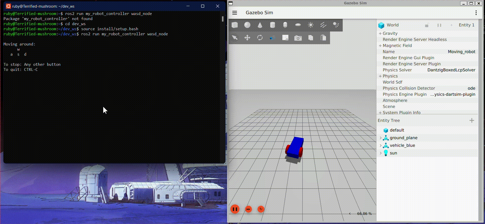

# ROS 2 Jazzy WASD Gazebo Controller

## Project Overview
This project enables real-time keyboard control of a differential drive robot within the Gazebo Sim (Harmonic) environment using ROS 2 Jazzy Jalisco. It features a custom Python node that captures keyboard input and translates it into velocity commands.

## Prerequisites
* **Operating System:** Ubuntu 24.04 (Noble Numbat) or compatible
* **ROS 2 Distribution:** Jazzy Jalisco
* **Simulation:** Gazebo Sim Harmonic
* **Key Packages:**
    * `ros-jazzy-ros-gz`
    * `geometry_msgs`
    * `rclpy`

